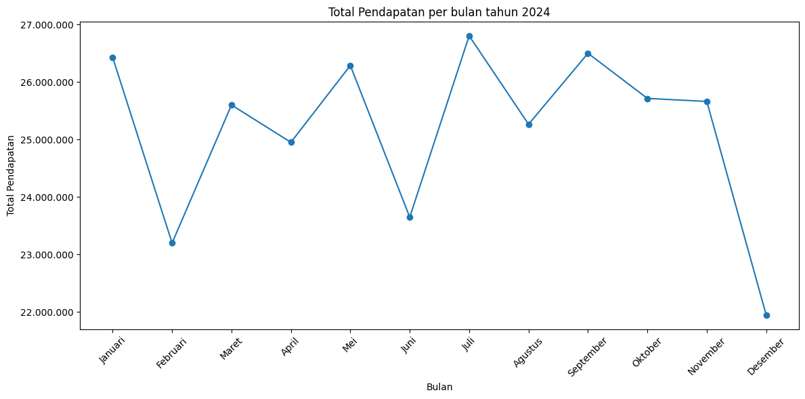

# Visualisasi-Data-Ecommerce

## Deskripsi
Proyek ini melakukan data cleaning dan visualisasi pada dataset penjualan.

## Tools
- Python, pandas, matplotlib

## Langkah Pengerjaan
1. Baca dataset (pd.read_csv)
2. Cek missing value dan duplikasi
3. Perbaiki tipe data tanggal
4. Visualisasi total penjualan per bulan menggunakan line chart dan bar chart
   
6. Visualisasi proporsi platform pada jumlah transaksi menggunakan pie chart
7. Visualisasi total penjualan per kota menggunakan bar chart
